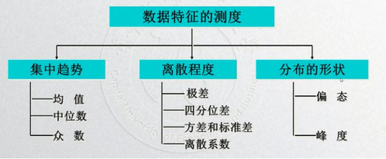

# 描述性统计分析

由于一些数据分析方法对数据的分布形式有限制，比如Pearson相似度量需要两变量均满足正态分布，因此在这章主要是根据描述性统计数据，对数据的大致分布形式进行测度。其中数据分布特征的测度主要分为三部分，也将根据这三部分对数据的分布特征进行说明：

### 总体分布的集中趋势

众数、中位数、均值的特点和应用：

* 众数：不受极端值影响；具有不唯一性；数据分布倾斜较大且有明显峰值时使用
* 中位数：不受极端值影响；数据分布倾斜较大时应用
* 均值：易受极端值影响；数学性质优良；数据对称分布或接近对称分布时使用；

### 总体分布的离散程度

* 四分位差=\(QU-QL\)/2，其中QU是75%分位数，QL是25%分位数，四分位差越大，数据离散程度越大；
* 方差/标准差：数据的方差/标准差越大，数据的离散程度越大；
* 离散系数：标准差与其相应的均值之比，用于比较两组数据的波动程度；

### 总体分布的形状

Pearson偏度系数是以标准差为度量单位，计算众数和算数平均数的离差，其计算公式为：

$$
SK=\frac{\bar{X}-M_0}{σ}
$$

其中M\_0为众数；SK的取值通常为-3~+3之间，其绝对值大，表明倾斜程度大反之表明倾斜程度越小。

* 当SK=0时，分布为对称分布；
* 当SK&lt;0时，分布呈左偏分布，或称负偏态；
* 当SK&gt;0时，分布呈右偏斜分布，或称为正偏态；

峰态系数就是反映数据分布峰值的高低，可以用来说明数据分布曲线的顶端尖削或扁平程度。以正态分布为参照标准，比正态分布尖削的分布为尖峰分布，比正态分布扁平的分布为平顶分布；

